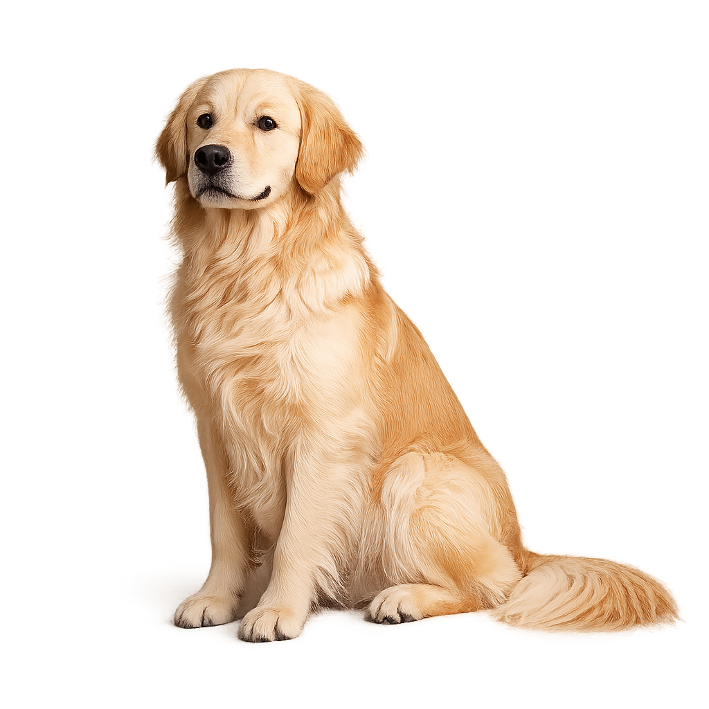

# 🐾 Pawtopia – The Dog Hub

<div align="center">



### Discover. Explore. Fall in Love with Dogs.

A modern, responsive web application built with **Node.js**, **Express.js**, **EJS**, and the **Dog CEO API**, allowing users to browse hundreds of dog breeds, explore breed-specific images, discover sub-breeds, and meet a random lucky pup every time they visit.

[🌐 Live Demo](https://pawtopia-dog-hub.onrender.com/) •
[📂 GitHub Repository](https://github.com/prerna-sharma-only/-Pawtopia)

</div>

---

## 🌟 About The Project

**Pawtopia** is more than just an API integration project.

Instead of displaying raw API responses, the application transforms data from the **Dog CEO API** into an interactive experience where users can seamlessly navigate through breeds, discover random dogs, and explore detailed breed galleries.

The objective behind this project was not only to consume a REST API but also to practice building a complete server-side rendered web application with Express, dynamic routing, EJS templating, and a fully responsive user interface.

Every page is generated dynamically using real-time API responses, ensuring that the content remains fresh without manually storing any dog information.

---

# ✨ Features

## 🐶 Breed Atlas

Browse the complete collection of dog breeds available through the Dog CEO API.

Instead of hardcoding breed names, Pawtopia dynamically fetches the entire breed catalogue and generates interactive breed cards on the fly.

### Users can

- Browse hundreds of breeds
- Open individual breed pages
- Navigate to breed-specific galleries
- Explore available sub-breeds

---

## 🎲 Lucky Pup

Need a smile?

The **Lucky Pup** page fetches a completely random dog image every single time.

To make every visit unique, the application also displays a randomly selected wholesome dog quote generated from a custom JavaScript array.

Every refresh creates a brand-new experience.

---

## 📸 Breed Explorer

Each breed has its own dynamic exploration page.

Rather than displaying the same image repeatedly, Pawtopia retrieves all available images for that breed and randomly selects one image before rendering the page.

This makes every visit feel different while reducing repetitive content.

---

## 🦴 Sub-Breed Explorer

Some breeds contain multiple sub-breeds.

Instead of treating every breed identically, Pawtopia first checks whether sub-breeds exist.

If they do, users can navigate into individual sub-breed galleries where another randomly selected image is displayed.

This creates a multi-level browsing experience using nested dynamic routes.

---

# 🎯 Why This Project?

Most beginner API projects simply fetch JSON data and print it on the screen.

Pawtopia was designed differently.

The focus was to build an application that feels like a real product rather than an assignment.

The project combines

- REST API integration
- Server-side rendering
- Dynamic routing
- Responsive design
- Interactive navigation
- Clean UI/UX
- Real-time content generation

into one cohesive application.

---

##  Home Page


---

##  Breed Atlas

 


---

##  Lucky Pup


---

## 📸 Breed Explorer


---

# 🚀 Live Demo

### 🌐 Website

https://pawtopia-dog-hub.onrender.com/

---

# 💻 Built With

| Technology | Purpose |
|------------|----------|
| Node.js | Backend Runtime |
| Express.js | Server Framework |
| EJS | Server Side Rendering |
| Axios | HTTP Client |
| Dog CEO API | Dog Data |
| HTML5 | Structure |
| CSS3 | Styling |
| JavaScript | Client-side Interaction |
| Render | Deployment |
| Git & GitHub | Version Control |

---
# 🧠 Project Architecture

Pawtopia follows a simple yet scalable server-side rendering architecture.

```text
                User Request
                     │
                     ▼
              Express Route
                     │
                     ▼
          Axios HTTP Request
                     │
                     ▼
              Dog CEO API
                     │
                     ▼
          API Response (JSON)
                     │
                     ▼
        Data Processing & Logic
                     │
                     ▼
              EJS Template
                     │
                     ▼
          Rendered HTML Page
                     │
                     ▼
                Browser
```

Instead of storing any breed information locally, every page fetches fresh data directly from the Dog CEO API before rendering.

This keeps the application lightweight while ensuring that users always receive the latest available information.

---

# 🌐 API Integration

The project consumes multiple endpoints from the Dog CEO API.

Each endpoint serves a unique purpose inside the application.

| Endpoint | Purpose |
|----------|---------|
| `/breeds/list/all` | Retrieve all available breeds |
| `/breeds/image/random` | Fetch a random dog image |
| `/breed/:breed/images` | Retrieve every image of a breed |
| `/breed/:breed/list` | Retrieve sub-breeds |
| `/breed/:breed/:subbreed/images` | Retrieve images of a sub-breed |

Axios is responsible for making asynchronous HTTP requests while Express waits for the response before rendering the appropriate EJS page.

---

# 🛣 Application Routing

The entire application is powered by dynamic Express routes.

## Home Route

```text
GET /
```

Displays the landing page introducing Pawtopia and provides navigation to the application's core features.

---

## Breed Atlas

```text
GET /breeds
```

### Logic

```
User clicks Breed Atlas
        │
        ▼
Axios requests complete breed list
        │
        ▼
Dog CEO API returns breed object
        │
        ▼
Object is passed to EJS
        │
        ▼
Breed cards generated dynamically
```

No breed names are hardcoded.

Every card is generated directly from the API response.

---

## Lucky Pup

```text
GET /random
```

### Logic

```
Generate random motivational quote
            │
            ▼
Request random dog image
            │
            ▼
Receive image URL
            │
            ▼
Render image + quote
```

Every refresh creates a different combination of

- Random Dog
- Random Dog Thought

making every visit unique.

---

## Breed Explorer

```text
GET /explore/:breed
```

This page demonstrates the use of **dynamic route parameters**.

### Workflow

```
User selects breed
        │
        ▼
Breed name becomes URL parameter
        │
        ▼
Axios requests all breed images
        │
        ▼
Random index generated
        │
        ▼
One image selected
        │
        ▼
Breed page rendered
```

Instead of displaying the first available image every time, Pawtopia randomly selects an image from the returned collection.

This small detail significantly improves the browsing experience by making repeated visits feel fresh.

---

## Sub-Breed Explorer

```text
GET /subbreeds/:breed
```

Some breeds contain multiple sub-breeds while others do not.

Instead of assuming every breed has children, Pawtopia first checks the API response.

### Workflow

```
User opens breed
        │
        ▼
Request sub-breed list
        │
        ▼
Sub-breeds exist?
      /      \
    Yes       No
     │         │
Display      Show empty
sub-breeds    state
```

This conditional rendering creates a much cleaner user experience.

---

## Individual Sub-Breed Gallery

```text
GET /subbreeds?name=:breed&sub=:subbreed
```

After selecting a sub-breed,

```
Breed
      │
      ▼
Sub-breed
      │
      ▼
Axios Request
      │
      ▼
Image Collection
      │
      ▼
Random Image
      │
      ▼
Rendered Page
```

The project once again avoids repetitive content by selecting a random image instead of displaying the same image repeatedly.

---

# 🎨 Design Philosophy

The visual identity of Pawtopia was intentionally designed to feel warm, playful, and elegant.

Instead of relying on bright saturated colors, a calm earthy palette was chosen to better match the theme of dogs and nature.

### Primary Palette

- Cream backgrounds
- Warm brown accents
- Soft gold highlights
- White content cards

Typography combines modern readability with elegant headings to create a premium appearance.

Every page follows a consistent spacing system, card design, and component styling to maintain visual harmony throughout the application.

---

# 📱 Responsive Strategy

Responsiveness was implemented without creating separate layouts.

Instead, carefully designed media queries progressively adapt the existing interface for different screen sizes.

Optimizations include:

- Responsive hero layout
- Flexible card grids
- Adaptive typography
- Sidebar navigation
- Mobile-friendly buttons
- Image scaling
- Improved spacing
- Stacked layouts for smaller devices

The application has been tested across desktop, tablet, and mobile screen sizes to ensure a consistent experience.

---

# 📂 Project Structure

```text
Pawtopia
│
├── public
│   ├── images
│   │   └── dog-hero.png
│   ├── js
│   │   └── script.js
│   └── styles
│       └── main.css
│
├── views
│   ├── partials
│   │      ├── header.ejs
│   │      └── footer.ejs
│   │
│   ├── home.ejs
│   ├── breedPage.ejs
│   ├── explore.ejs
│   ├── random.ejs
│   ├── subBreeds.ejs
│   └── breedExplore.ejs
│
├── index.js
├── package.json
└── README.md
```

---

# ⚙ Technical Highlights

✔ REST API Integration

✔ Server Side Rendering using EJS

✔ Express Dynamic Routing

✔ Axios HTTP Requests

✔ Responsive CSS

✔ Component-based Layout using Partials

✔ Random Image Selection Logic

✔ Conditional Rendering

✔ Mobile Friendly Design

✔ Deployment using Render

---

# 🚀 Getting Started

Follow these steps to run Pawtopia locally.

## Clone the Repository

```bash
git clone https://github.com/YOUR_USERNAME/pawtopia-dog-hub.git
```

Move into the project directory.

```bash
cd pawtopia-dog-hub
```

Install all dependencies.

```bash
npm install
```

Start the server.

```bash
npm start
```

Open your browser and visit

```
http://localhost:3000
```

---

# 🔧 Environment

Pawtopia does not require any API keys.

All data is fetched from the public **Dog CEO API**, making the application easy to run without additional configuration.

---

# 💪 Challenges Faced

Building Pawtopia involved much more than simply displaying API responses.

Several interesting challenges were solved during development.

## 1. Transforming API Data

The Dog CEO API returns the breed list as a nested JavaScript object rather than a ready-to-render array.

Instead of hardcoding breed names, the application dynamically processes this object and generates the Breed Atlas using EJS templates.

---

## 2. Dynamic Routing

One of the biggest learning experiences was creating reusable dynamic routes.

Instead of creating separate pages for every breed, Express route parameters allow one route to handle every possible breed.

Examples include:

```
/explore/husky
/explore/beagle
/explore/pug
```

The same route works for every breed returned by the API.

---

## 3. Random Image Rendering

Many APIs always return images in the same order.

To avoid showing identical images every time, Pawtopia first retrieves the complete image collection and then randomly selects one image before rendering the page.

This small improvement makes the browsing experience feel much more natural.

---

## 4. Conditional Rendering

Not every breed contains sub-breeds.

Instead of displaying empty sections, the application intelligently checks whether sub-breeds exist before deciding what to render.

This creates a cleaner and more user-friendly interface.

---

## 5. Responsive Layout

The interface was originally designed for desktop screens.

A complete responsive layer was later implemented using media queries to ensure the application works smoothly across desktop, tablet, and mobile devices without changing the overall design language.

---

# 📚 What I Learned

Developing Pawtopia strengthened my understanding of:

- Express.js Routing
- Dynamic URL Parameters
- REST API Integration
- Axios HTTP Requests
- Server-Side Rendering with EJS
- Template Partials
- Responsive Web Design
- Component-Based UI Design
- Error Handling
- Deploying Node.js Applications on Render
- Git & GitHub Workflow

More importantly, this project taught me how to transform raw API data into a polished user experience instead of simply displaying JSON responses.

---

# 🔮 Future Improvements

Although Pawtopia is fully functional, there are many exciting ideas that could further enhance the application.

### Planned Features

⭐ Favorite Breeds

Allow users to save their favorite breeds.

---

⭐ Breed Search Suggestions

Autocomplete while typing breed names.

---

⭐ Multiple Breed Gallery

Display multiple images instead of one random image.

---

⭐ Breed Comparison

Compare two breeds side-by-side.

---

⭐ Dark Mode

Provide both light and dark themes.

---

⭐ Infinite Image Gallery

Allow users to continue exploring additional images without refreshing the page.

---

# 🚀 Deployment

The application is deployed on **Render**.

Every push to the **main** branch automatically triggers a new deployment, ensuring that the live application always stays synchronized with the latest version of the project.

---

# 🙋‍♀️ Author

### Prerna Sharma

Passionate about building modern, responsive, and user-friendly web applications while continuously exploring backend development, APIs, and full-stack technologies.

GitHub:
(https://github.com/prerna-sharma-only)

LinkedIn:
(https://www.linkedin.com/in/prerna-sharma-10425a360)


---

# ⭐ Final Thoughts

Pawtopia began as an opportunity to practice working with a public REST API, but it quickly evolved into a complete full-stack learning experience.

Rather than simply consuming API data, the project focuses on creating an engaging experience through dynamic routing, server-side rendering, responsive design, and thoughtful user interface decisions.

Every page is generated dynamically, every breed is fetched in real time, and every interaction is designed to make exploring the world of dogs enjoyable.

This project reflects not only my technical skills with **Node.js**, **Express.js**, **EJS**, **Axios**, and **REST APIs**, but also my passion for creating clean, responsive, and user-focused web applications.

If you found this project interesting, feel free to ⭐ the repository and share your feedback!

---
